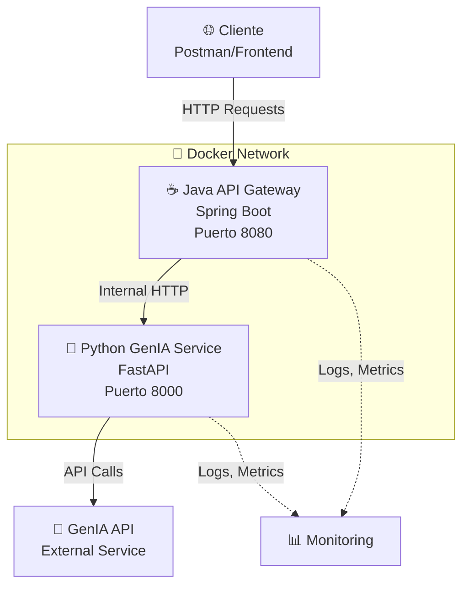

# 🚀 GenIA Integration Project

[](https://openjdk.org/)
[](https://python.org/)
[](https://spring.io/projects/spring-boot)
[](https://fastapi.tiangolo.com/)
[](https://docker.com/)
[](https://python-poetry.org/)

**Proyecto de integración de microservicios para consultas de inteligencia artificial usando GenIA API con arquitectura Java Spring Boot + Python FastAPI.**

---

## 📋 Tabla de Contenidos

- [🎯 Descripción](#-descripción)
- [🏗️ Arquitectura](#️-arquitectura)  
- [🛠️ Tecnologías](#️-tecnologías)
- [🚀 Inicio Rápido](#-inicio-rápido)
- [📊 Endpoints](#-endpoints)
- [🏗️ Estructura del Proyecto](#️-estructura-del-proyecto)
- [🧪 Testing](#-testing)
- [🐳 Docker & Deployment](#-docker--deployment)
- [👥 Desarrollo Colaborativo](#-desarrollo-colaborativo)
- [📚 Documentación](#-documentación)
- [🤝 Contribución](#-contribución)

---

## 🎯 Descripción

Este proyecto implementa una **arquitectura de microservicios** que permite realizar consultas a GenIA API de manera escalable y eficiente. La solución está diseñada para:

- ✅ **Separar responsabilidades** entre gateway (Java) y procesamiento IA (Python)
- ✅ **Escalar independientemente** cada servicio según demanda
- ✅ **Facilitar el desarrollo colaborativo** entre equipos Java y Python
- ✅ **Proporcionar una API robusta** con validaciones y manejo de errores
- ✅ **Soportar ambientes de desarrollo y producción**

### 🎪 Demo en Vivo

```bash
# Ejemplo de consulta
curl -X POST http://localhost:8080/api/genia/query/mock \
  -H "Content-Type: application/json" \
  -d '{
    "prompt": "Explícame qué es la inteligencia artificial",
    "maxTokens": 150,
    "temperature": 0.7
  }'
```

---

## 🏗️ Arquitectura

### 📊 Diagrama de Arquitectura



### 🔄 Flujo de Datos

1. **Cliente** envía request a Java Gateway (`localhost:8080`)
2. **Java Gateway** valida, autentica y procesa la request
3. **Gateway** hace llamada HTTP interna al Python Service (`localhost:8000`)
4. **Python Service** se conecta con GenIA API externa
5. **Respuesta** fluye de vuelta: GenIA → Python → Java → Cliente

### 🎯 Beneficios de esta Arquitectura

| Aspecto | Beneficio |
|---------|-----------|
| **🔧 Tecnología** | Cada servicio usa el stack óptimo para su función |
| **📈 Escalabilidad** | Escalar servicios independientemente según carga |
| **👥 Equipos** | Desarrollo paralelo Java vs Python |
| **🚀 Deploy** | Deployment independiente y rollback granular |
| **🧪 Testing** | Testing aislado por servicio + integration tests |

---

## 🛠️ Tecnologías

### ☕ Java API Gateway
- **Spring Boot 3.1.5** - Framework principal
- **Maven** - Gestión de dependencias
- **Spring Web** - REST API
- **Spring Validation** - Validación de datos
- **RestTemplate** - Cliente HTTP
- **Actuator** - Health checks y métricas

### 🐍 Python GenIA Service  
- **FastAPI** - Framework web asíncrono
- **Poetry** - Gestión moderna de dependencias
- **Pydantic** - Validación de datos automática
- **HTTPX** - Cliente HTTP asíncrono
- **Uvicorn** - Servidor ASGI

### 🐳 DevOps & Tools
- **Docker & Docker Compose** - Containerización
- **Postman** - Testing de APIs
- **GitHub** - Control de versiones
- **Poetry** - Dependency management Python

---

## 🚀 Inicio Rápido

### 📋 Prerequisitos

- **Java 17+** 
- **Python 3.9+**
- **Docker & Docker Compose**
- **Poetry** (para Python)
- **Maven** (para Java)

### ⚡ Opción 1: Docker Compose (Recomendado)

```bash
# 1. Clonar el repositorio
git clone https://github.com/Christian-Rojas-Rodriguez/test-genIA.git
cd test-genIA

# 2. Configurar variables de entorno
cp .env.example .env
# Editar .env con tus credenciales de GenIA API

# 3. Levantar todo el stack
docker-compose up --build -d

# 4. Verificar que está funcionando
curl http://localhost:8080/api/genia/health
curl http://localhost:8000/health

# 5. Ver logs
docker-compose logs -f
```

### 🔧 Opción 2: Desarrollo Local

#### Python Service
```bash
cd python-genia-service

# Instalar dependencias con Poetry
poetry install

# Activar entorno virtual
poetry shell

# Ejecutar servicio
poetry run uvicorn src.main:app --reload --port 8000
```

#### Java Gateway
```bash
cd java-api-gateway

# Compilar y ejecutar con Maven
mvn spring-boot:run

# O compilar JAR y ejecutar
mvn clean package
java -jar target/api-gateway-1.0.0.jar
```

---

## 📊 Endpoints

### ☕ Java API Gateway (`localhost:8080`)

| Método | Endpoint | Descripción | Ejemplo |
|--------|----------|-------------|---------|
| `POST` | `/api/genia/query` | Consulta real a GenIA | [Ver ejemplo](#ejemplos) |
| `POST` | `/api/genia/query/mock` | Consulta mock para testing | [Ver ejemplo](#ejemplos) |
| `GET` | `/api/genia/health` | Health check del gateway | - |
| `GET` | `/api/genia/status` | Status detallado | - |

### 🐍 Python Service (`localhost:8000`)

| Método | Endpoint | Descripción | Acceso |
|--------|----------|-------------|--------|
| `GET` | `/health` | Health check simple | Directo |
| `GET` | `/docs` | Documentación interactiva | Solo dev |
| `POST` | `/query` | Endpoint interno GenIA | Via Gateway |
| `POST` | `/query/mock` | Endpoint interno mock | Via Gateway |

### 📋 Ejemplos de Uso

#### Consulta Básica
```bash
curl -X POST http://localhost:8080/api/genia/query/mock \
  -H "Content-Type: application/json" \
  -d '{
    "prompt": "¿Qué es la programación funcional?",
    "maxTokens": 200,
    "temperature": 0.7
  }'
```

#### Respuesta Esperada
```json
{
  "response": "[MOCK] Respuesta simulada para: '¿Qué es la programación funcional?'...",
  "tokens_used": 45,
  "model": "mock-genia",
  "processing_time": 0.52
}
```

---

## 🏗️ Estructura del Proyecto
```bash
test-genIA/
├── 📄 README.md # Este archivo
├── 🐳 docker-compose.yml # Orquestación de servicios
├── 🌍 .env # Variables de entorno
├── 📮 postman/ # Colección de testing
│ ├── GenIA-Integration.postman_collection.json
│ └── README.md
├── ☕ java-api-gateway/ # Microservicio Java
│ ├── 📦 pom.xml # Dependencias Maven
│ ├── 🐳 Dockerfile # Container Java
│ ├── 📚 README.md # Docs específicas Java
│ └── 📁 src/main/java/com/genia/gateway/
│ ├── 🚀 Application.java # Main class
│ ├── 🎮 controller/ # REST Controllers
│ ├── 📊 model/ # DTOs y modelos
│ └── 🔧 service/ # Lógica de negocio
└── 🐍 python-genia-service/ # Microservicio Python
├── 📦 pyproject.toml # Poetry dependencies
├── 🔒 poetry.lock # Lock file
├── 🐳 Dockerfile # Container Python
├── 📚 README.md # Docs específicas Python
├── 📁 src/ # Código fuente
│ ├── 🚀 main.py # FastAPI app
│ ├── ⚙️ config.py # Configuración
│ ├── 📊 models.py # Modelos Pydantic
│ └── 🔧 services.py # Integración GenIA
└── 🧪 tests/ # Tests unitarios
```

---

## 🧪 Testing

### 🔄 Testing Automatizado

```bash
# Ejecutar toda la suite de tests
docker-compose exec python-service poetry run pytest
docker-compose exec java-gateway mvn test

# Tests con coverage
docker-compose exec python-service poetry run pytest --cov=src
```

### 📮 Testing Manual con Postman

1. **Importar colección**: `postman/GenIA-Integration.postman_collection.json`
2. **Configurar environment**: Usar variables para localhost/docker
3. **Ejecutar tests**: Health checks → Mock queries → Production queries

### 🧪 Test de Integración End-to-End

```bash
# Test completo del flujo
bash scripts/integration-test.sh
```

---

## 🐳 Docker & Deployment

### 🏗️ Build Containers

```bash
# Build servicios individuales
docker build -t genia-java-gateway ./java-api-gateway
docker build -t genia-python-service ./python-genia-service

# Build con docker-compose
docker-compose build
```

### 🚀 Production Deployment

```bash
# Deployment en producción
docker-compose -f docker-compose.prod.yml up -d

# Scaling específico
docker-compose up -d --scale python-service=3 --scale java-gateway=2

# Health monitoring
docker-compose ps
docker-compose logs --tail=50 -f
```

### 📊 Monitoring & Logs

```bash
# Ver logs en tiempo real
docker-compose logs -f

# Logs específicos por servicio
docker-compose logs -f java-gateway
docker-compose logs -f python-service

# Métricas de health
curl http://localhost:8080/actuator/health
curl http://localhost:8000/health/detailed
```

---

## 👥 Desarrollo Colaborativo

### 🔀 Git Workflow

```bash
# Feature development
git checkout -b feature/nueva-funcionalidad
git commit -m "feat: agregar nueva funcionalidad"
git push origin feature/nueva-funcionalidad

# Pull request → Code review → Merge
```

### 🎯 División de Trabajo Sugerida

| Team | Responsabilidad | Tecnologías |
|------|----------------|-------------|
| **Backend Java** | API Gateway, validaciones, auth | Spring Boot, Maven |
| **Backend Python** | IA integration, data processing | FastAPI, Poetry |
| **DevOps** | Docker, CI/CD, deployment | Docker, GitHub Actions |
| **QA** | Testing, Postman collections | Postman, pytest |

### 📋 Code Standards

- **Java**: Spring Boot best practices, Maven conventions
- **Python**: PEP 8, Poetry dependency management  
- **Git**: Conventional commits (`feat:`, `fix:`, `docs:`)
- **Docker**: Multi-stage builds, health checks

---

## 📚 Documentación

### 📖 Documentación por Servicio

- **Java Gateway**: [`java-api-gateway/README.md`](./java-api-gateway/README.md)
- **Python Service**: [`python-genia-service/README.md`](./python-genia-service/README.md)
- **Postman Testing**: [`postman/README.md`](./postman/README.md)

### 🔧 API Documentation

- **FastAPI Docs**: http://localhost:8000/docs (desarrollo)
- **Spring Boot Actuator**: http://localhost:8080/actuator (monitoring)

### 🎯 Environment Setup

```bash
# Desarrollo
ENVIRONMENT=development
DEBUG=true

# Producción  
ENVIRONMENT=production
DEBUG=false
GENIA_API_KEY=your-production-key
```

---

## 🤝 Contribución

### 🚀 Cómo Contribuir

1. **Fork** el repositorio
2. **Crear** branch para tu feature (`git checkout -b feature/AmazingFeature`)
3. **Commit** tus cambios (`git commit -m 'feat: Add some AmazingFeature'`)
4. **Push** al branch (`git push origin feature/AmazingFeature`)
5. **Abrir** Pull Request

### 📋 Guidelines

- ✅ Seguir convenciones de código establecidas
- ✅ Agregar tests para nuevas funcionalidades  
- ✅ Actualizar documentación cuando sea necesario
- ✅ Asegurar que todos los tests pasen
- ✅ Usar conventional commits

### 🐛 Reportar Issues

Al reportar issues, incluye:
- **Descripción clara** del problema
- **Pasos para reproducir**
- **Comportamiento esperado** vs actual
- **Environment info** (OS, Java version, Python version)
- **Logs relevantes**

---

## 📞 Contacto & Support

- **GitHub Issues**: Para bugs y feature requests
- **Email**: christian.rojas@mercadolibre.com
- **GitHub**: [@Christian-Rojas-Rodriguez](https://github.com/Christian-Rojas-Rodriguez)

---

## 📜 Licencia

Este proyecto está bajo la Licencia MIT. Ver [`LICENSE`](LICENSE) para más detalles.

---

<div align="center">

**⭐ Si este proyecto te resulta útil, ¡dale una estrella! ⭐**

[🚀 Getting Started](#-inicio-rápido) • [📊 API Docs](#-endpoints) • [🐳 Docker](#-docker--deployment) • [🤝 Contribute](#-contribución)

</div>